# 爱与家庭任务线

## **目录**

- [开启任务](#先去东瘟疫之地找到提里奥弗丁)
- [证明你的价值](#证明你的价值)
- [提里奥·弗丁的故事](#提里奥弗丁的故事)
- [失落的荣耀](#失落的荣耀)
- [爱与家庭](#爱与家庭)
- [寻找麦兰达](#寻找麦兰达)
- [血色幻想](#血色幻想)
- [在梦中](#在梦中)

## **简要说明**

提里奥是原白银之手骑士团的大领主，后来因为其与兽人密切的交情，被阿尔萨斯以莫须有的罪名被流放到了东瘟疫之地生活，原本的提里奥也很坦然的接受了这一切，在这里生活也悠闲自得。

但是命运却是如此的做弄人，提里奥的小儿子泰兰却加入了血色十字军（白银之手解散后，部分骑士团成员组织了血色十字军），并且成为了马登霍尔顿的大领主

提里奥认为血色十字军是白银之手骑士团做出的一个非常错误的决定，于是他要求玩家前去引导泰兰，让他记起曾经的高贵与荣耀，提里奥告诉脚男，自己送给儿子泰兰的第一个玩具是一个小小的**战锤**。

当提里奥因罪被流放的时候，提里奥的妻子，泰兰的母亲告诉泰兰：提里奥战死了。泰兰非常的伤心，将那个小小的战锤和自己对父亲的记忆，埋在了东瘟疫南边，那个所谓的“坟墓”里。

提里奥要游戏脚男前去东瘟疫南部墓室，取得那个战锤。取的战锤后，提里奥告诉脚男，乌瑟尔被杀后，白银之手骑士团就被瓦解了。泰兰发现这一切后，十分伤心，在北谷泰兰抛弃了骑士团的战旗，并将自己的荣耀也留在了那里。提里奥要脚男前去北谷，将**荣耀战旗**带回来。

战旗被带回后，提里奥告诉脚男，曾经幸福的一家很久以前去凯尔达隆度假（现在就是著名的通灵学院所在地）的时候，著名的画家瑞弗雷为这个幸福美好的家庭，画了一幅画，**这幅画叫做——爱与家庭**。提里奥要求脚男前去那里，找到这幅画。

瑞弗雷告诉游戏脚男，自从提里奥被流放后，她就不敢在公共场合放置这幅画，后来为了保存这幅画，她对画表面做了伪装。现在这幅画可能在斯坦索姆之中，她要求玩家前去斯坦索姆寻找这幅画。

**当所有的一切准备好了之后**

提里奥要求玩家前去乌瑟尔之墓找到巫女米兰达。她可以将玩家幻化成血色十字军的一员，然后可以深入壁炉谷，找到泰兰。

当脚男将所有的这一切带给了泰兰，并告诉泰兰他崇拜的父亲还健在的时候，他多年来的愤怒和思念终于爆发了。他决心抛弃一切，去追随父亲

**结局**

可能所有的玩家都希望是这样一个结局——泰兰最终和提里奥团聚，多年的未见，他们拥抱在了一切，泰兰向提里奥诉说自己多年的思念。

但是游戏里的结局很残酷，泰兰最终死在了大检察官的手下，提里奥晚到了一步，当看到儿子泰兰倒在地上的那一刻，我看到了一个伤心欲绝的父亲。

也因为泰兰的死，提里奥决心不再沉默，他要重整白银之手骑士团，完成自己的荣耀，以纪念泰兰。

# 先去东瘟疫之地找到提里奥·弗丁

**位置示意图**

**场景**

**[回到顶部](#爱与家庭任务线)**

# 证明你的价值

**做前置杀怪任务**

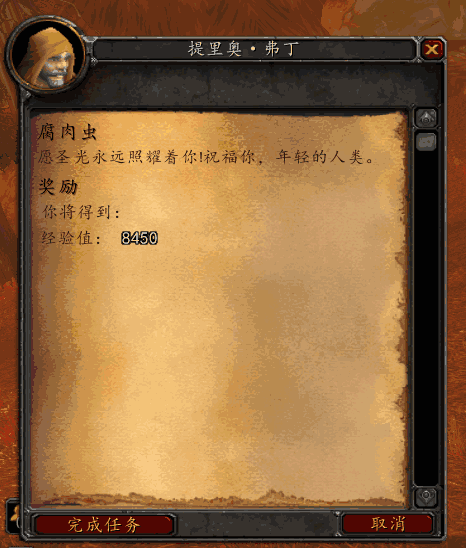

**[回到顶部](#爱与家庭任务线)**

# 提里奥·弗丁的故事

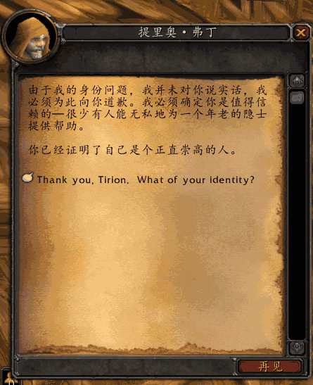

**[回到顶部](#爱与家庭任务线)**

# 泰兰之锤

**位置-在房子的后面有一个土堆**

**点击土堆-杀怪掉落`泰兰之锤`**

**[回到顶部](#爱与家庭任务线)**

# 失落的荣耀

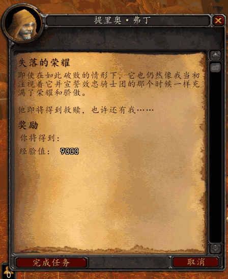

**[回到顶部](#爱与家庭任务线)**

# 爱与家庭

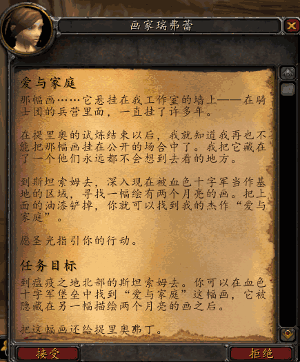

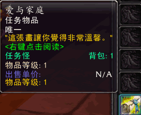

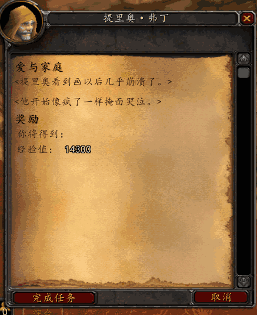

**[回到顶部](#爱与家庭任务线)**

# 寻找麦兰达

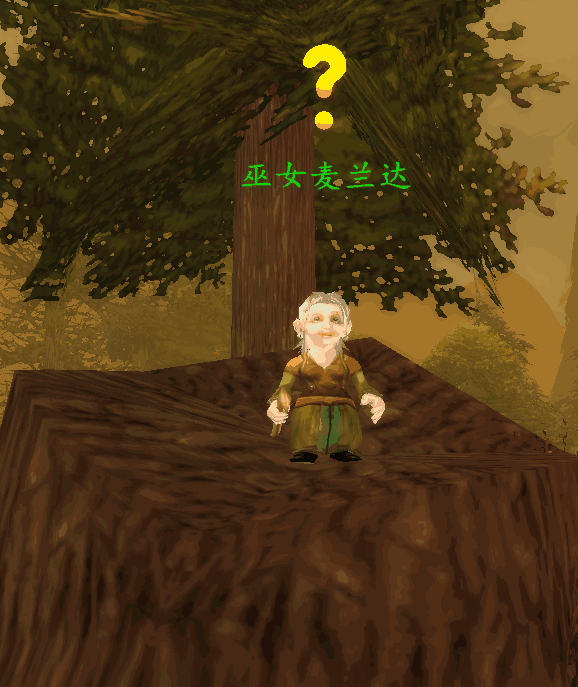
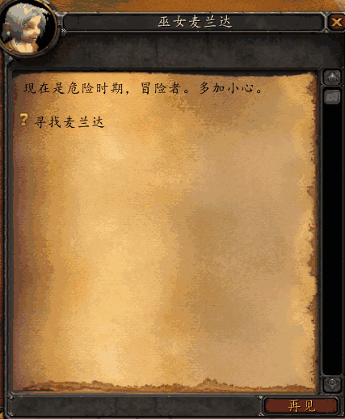

**[回到顶部](#爱与家庭任务线)**

# 血色幻想

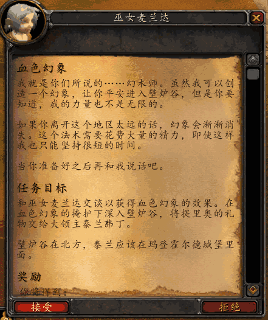

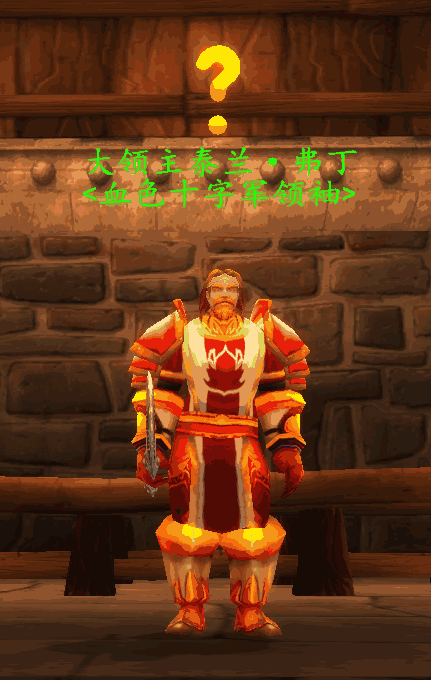
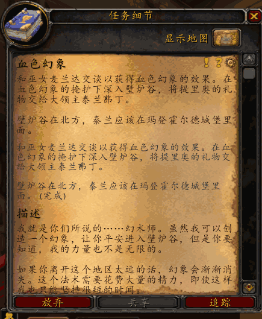

**[回到顶部](#爱与家庭任务线)**

# 在梦中

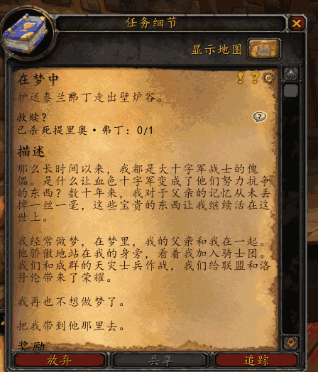

大检察官那里是这样的情况，小弗丁最后一定要死的，所以别管，死了以后老弗丁骑着马赶来给小弗丁报仇，然后等老弗丁清场后站在那里等你交任务

- 小弗丁打的时候千万别上，那个大检察官会精神控制，能把玩家控制了，然后就算你是开了盾墙的战士都抗不住小弗丁几下

- 老爸确实比儿子牛，所以，老弗丁来的时候更不要让大检察官看见你，他自己完全能搞定

- 这个任务说是护送他，实际上是他护送你

**[回到顶部](#爱与家庭任务线)**
